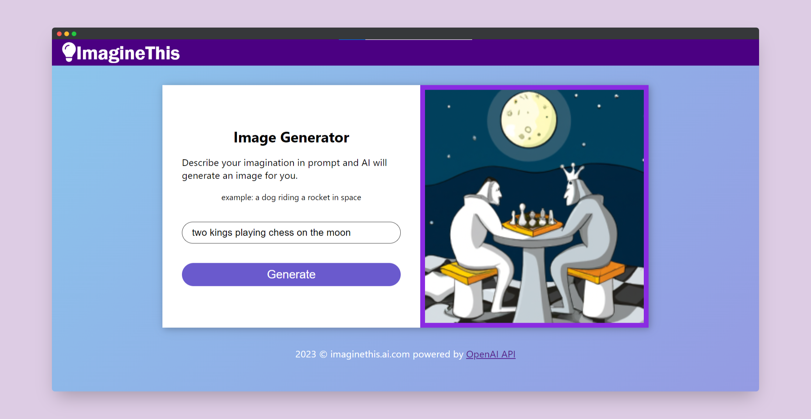

- [🖼 Imagine This](#-imagine-this)
  - [🛠 Tech Stack](#-tech-stack)
  - [🎨 Features](#-features)
  - [🚀 Live Demo](#-live-demo)
  - [⚙ Getting Started](#-getting-started)
  - [📧 Contact](#-contact)
  - [🤝 Contributing](#-contributing)
  - [💖 Show your support](#-show-your-support)
  - [📜 License](#-license)

# 🖼 Imagine This

*Imagine This* is a web application that allows users to generate images using text prompts. 



## 🛠 Tech Stack
- React
- Express
- [OpenAI API](https://beta.openai.com/docs/guides/images/usage?lang=node.js)

## 🎨 Features
- User-friendly interface
- Instant image generation

## 🚀 Live Demo
Try out the live version on [imaginethis.ai](https://indiecodermm.github.io/imagine-this)

## ⚙ Getting Started
To run this app on your local machine, follow these steps:

1. Clone this repository into your desired folder.
```sh
git clone git@github.com:IndieCoderMM/imagine-this.git
```
2. Install dependencies in `client/` and `server/` directories.
```sh
npm i --prefix client
npm i --prefix server
```
3. Create `.env` file inside `server/` folder and add your [OpenAI_API_KEY](https://beta.openai.com/account/api-keys).
```sh
OPENAI_API_KEY="sk-adfjeofoefkn........"
```
4. Run the development server.
```sh
cd server
npm run dev
```
5. Inside `client/src/App.js`, set `API_URL` to `"/openai/imagine"`.
6. Start the application.
```sh
npm start
```

## 📧 Contact

I am always looking for ways to improve my project. If you have any suggestions or ideas, I would love to hear from you.

[](https://github.com/IndieCoderMM)
[](https://twitter.com/hthant_oo)
[](https://linkedin.com/in/hthantoo)
[](hthant00chk@gmail.com)

## 🤝 Contributing

I welcome any and all contribution that can help me improve my project. If you have any ideas or feedback that you'd like to share, please don't hesitate to reach out.

## 💖 Show your support

If you like this project, you can support me by giving a ⭐.

## 📜 License

This project is [MIT](./LICENSE) licensed.